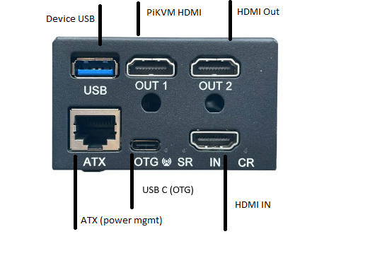

#  PiKVM v4 Plus physical ports 

Lets start with take a look at the PiKVM physical ports

## Front
At the front we have the following ports 

1. USB, used to connect to the and wil acts at a mouse and keybord
2. PiKVM HDMI is the HDMI output of the PiKVM 
3. HDMI Out i connected to the montor so that PiKVM aces a a man in the middel on the video stream 
4. ATX is used to controll the power of the computer/server. For this to work you need to use a ATX card and installed in to install it between the power/resett button and the power connections on the motherboard
5. HDMI port connects to the computer/server hdmi out so the PiKVM get the video steam form the device. 

## Back side

!(Back.png)

1. 12V Power
2. USB to the PiKVM 
3. RJ45 or USB C to 
4. 5V usb C Power
5. SD-card for opertating system
6. Ethernet port for internett access

##  More Detiled overview
Here is a more deatail port view for the device

!(PiKVM connections.jpg)

## Extra

This ATX card can be connected between the power buttons and motherboard for remote control of the power/rettes buttons.
in comes with two mounts, one low and one high profile so i dont founts inside of the motherborad 

!(ATX cards.jpg)
!(Mounts.jpg)

There is also a spesial vga to hdmi adapter. from my reading there my be problems if you get another adapter so be aware.  

!(HDMI adapter.jpg)

# Getting started with PiKVM

Lets connect the PiKVM to power, internett and computer/sever 

(PiKVM Connection.png)

## Step 1: Accesing the device

The bare minminum you need to connection the PiKVM to power and ethernet.

You can access the PiKVM via HTTPS or SSH

There are multibel ways to IP address of the PiKVM
1. look the the display
2. look at the arp table on the router
3. scann the network with a network scanner

use the following default passwords

default web username: admin
default web passord: admin

default ssh username: root
default ssh password: root

## Step 2: House keeping

lets so some basic keeping for the device. 

### Change web portal password
Log in the web portal and do the

### Change web portal password

Change 

### update the device

### verify that PiKVM is working as inteded 

