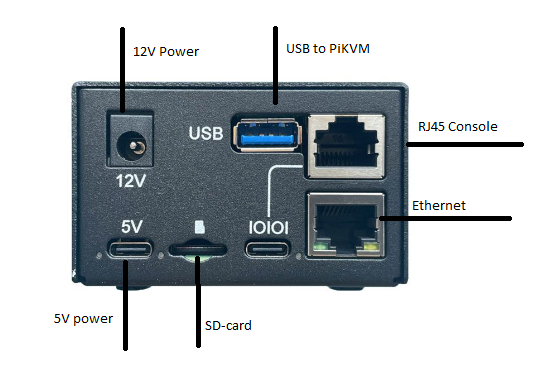
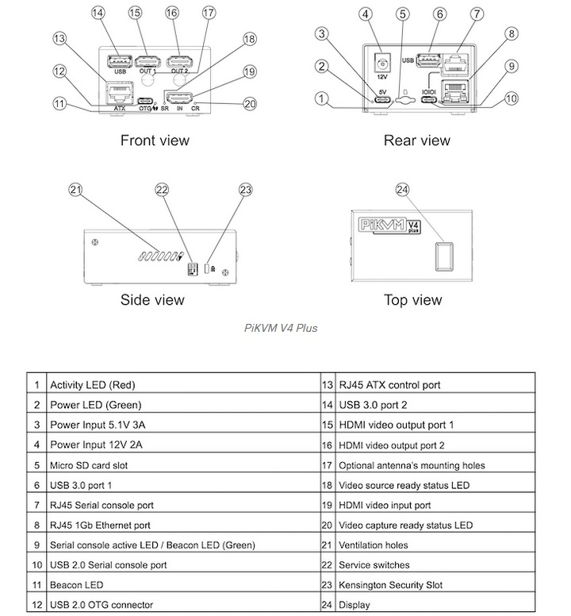
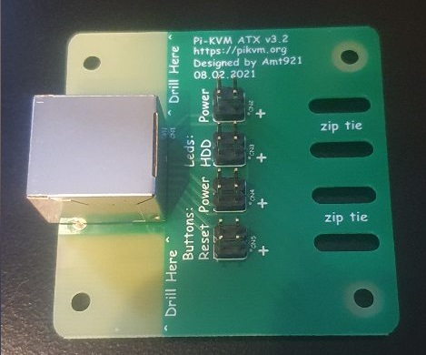
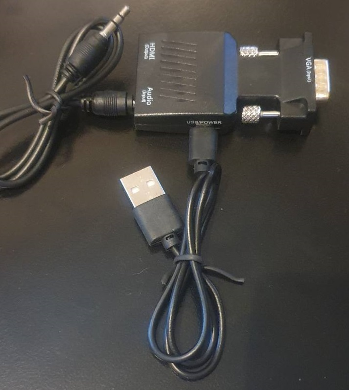
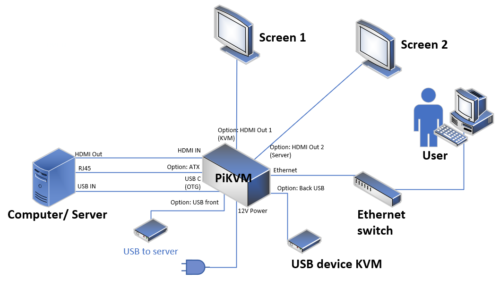

#  PiKVM v4 Plus physical ports 

Lets start with take a look at the PiKVM physical ports


## Front
At the front we have the following ports 


1. USB, used to connect to the and wil acts at a mouse and keybord
2. PiKVM HDMI is the HDMI output of the PiKVM 
3. HDMI Out i connected to the montor so that PiKVM aces a a man in the middel on the video stream 
4. ATX is used to controll the power of the computer/server. For this to work you need to use a ATX card and installed in to install it between the power/resett button and the power connections on the motherboard
5. HDMI port connects to the computer/server hdmi out so the PiKVM get the video steam form the device. 


## Back side





1. 12V Power
2. USB to the PiKVM 
3. RJ45 or USB C to 
4. 5V usb C Power
5. SD-card for opertating system
6. Ethernet port for internett access


##  More Detiled overview
Here is a more deatail port view for the device





## Extra

This ATX card can be connected between the power buttons and motherboard for remote control of the power/rettes buttons.
in comes with two mounts, one low and one high profile so i dont founts inside of the motherborad 





There is also a spesial vga to hdmi adapter. from my reading there my be problems if you get another adapter so be aware.  





# Getting started with PiKVM

Lets connect the PiKVM to power, internett and computer/sever 





## Step 1: Accesing the device

The bare minminum you need to connection the PiKVM to power and ethernet.
remember to  not turn off the device until it's fully booted for the first time.


You can access the PiKVM via HTTPS or SSH

There are multibel ways to IP address of the PiKVM
1. You can look the the display on the PiKVM
2. You look at the mac address table on the switch and find the mac address in the arp table of the router
3. Yuu can also scann the network with a network scanner to find the device. 


Use the following default credentios to access the PiKVM

default web username: admin
default web passord: admin

default ssh username: root
default ssh password: root


## Step 2: House keeping

lets so some basic keeping for the device. 

For enabling write mode

To enable write-mode, run command rw (under root).
```
[root@pikvm ~]# rw
```


To disable it, run command ro.
```
[root@pikvm ~]# ro
```


If you receive the message "Device is busy", perform reboot


### Step 2.1 Change root password

When loggined to ssh and in wr mode use the following command


```
[root@pikvm ~]# passwd root
```


### Step 2.2  Change web portal password


When loggined to ssh and in wr mode use the following command

```
[root@pikvm ~]# kvmd-htpasswd set admin
```

If you require additional user for the Web UI access, use the following:

```
[root@pikvm ~]# kvmd-htpasswd set <user> # Set a new user with password or change of an existing one
[root@pikvm ~]# kvmd-htpasswd del <user> # Remove/delete a user
```


### 2.3 update the device


To update, run following commands under the root user:

```
[root@pikvm ~]# pikvm-update
```

If you encounter an error like:

```
[root@pikvm ~]# pikvm-update
bash: pikvm-update: command not found
```

It's most likely you have an old OS release. You can update the OS as follows:

```
[root@pikvm ~]# rw
[root@pikvm ~]# pacman -Syy
[root@pikvm ~]# pacman -S pikvm-os-updater
[root@pikvm ~]# pikvm-update
```

Next time you will be able to use the usual method with pikvm-update.

### 2.4 Verify that PiKVM is working as inteded 


Connecet the PiKVM to a computer/server and check that everthing is working normaly. 

see this link for more built in featuers


