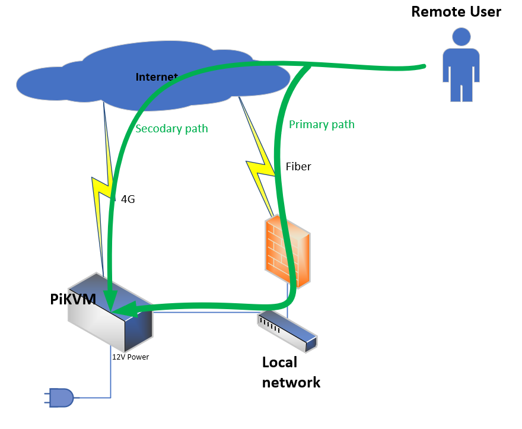

# Feature 2 - Tailscale VPN

To access your PiKVM from anywhere, you can use Tailscale VPN.

With Tailscale, you don't need NAT, port forwarding, etc.



Here is a copy of the Tailscale guide.

Enable read-write mode:

```sh
rw
```

Install the tailscale-pikvm package:

```sh
[root@pikvm ~]# pacman -Sy tailscale-pikvm
```

Enable and start the Tailscale service:

```sh
[root@pikvm ~]# systemctl enable --now tailscaled
Created symlink /etc/systemd/system/multi-user.target.wants/tailscaled.service -> /usr/lib/systemd/system/tailscaled.service.
```

Log in to Tailscale using the link provided by the command:

```sh
[root@pikvm ~]# tailscale up

To authenticate, visit:

        https://login.tailscale.com/a/a6b12<snip>1f80c

To approve your machine, visit (as admin):

        https://login.tailscale.com/admin

Success.
Some peers are advertising routes but --accept-routes is false
```

Enable SSH:

```sh
[root@pikvm ~]# tailscale set --ssh
```

Verify that you have an address and test from another device connected to the Tailscale network:

```sh
[root@pikvm ~]# ip add
<snip>
5: tailscale0: <POINTOPOINT,MULTICAST,NOARP,UP,LOWER_UP> mtu 1280 qdisc fq_codel state UNKNOWN group default qlen 500
    link/none 
    inet <snip> scope global tailscale0
       valid_lft forever preferred_lft forever
    inet6 <snip> scope global 
       valid_lft forever preferred_lft forever
    inet6 <snip> scope link stable-privacy proto kernel_ll 
       valid_lft forever preferred_lft forever
```
