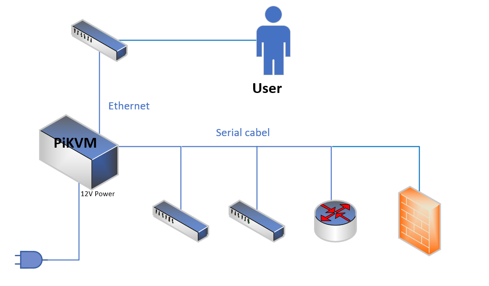
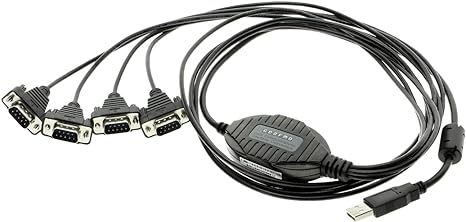

# Feature 2 - Console Server


Since I have alot devices(cisco netowrking devices) at using console i want the PiKVM to also act as a console server



  
You need will a Serial Adapter I want for this one Gearmo 4 Port USB to Serial RS232 Adapter  [Link](https://www.amazon.com/dp/B004ETDC8K?ref_=pe_386300_442618370_TE_sc_as_ri_0)

It has one usb to four Serial conncection. 




SSH to the PiKVM
Enable read-write mode.

```
rw
```


Install ser2net and start it

```
[root@pikvm ~]# sudo pacman -S ser2net
[root@pikvm ~]# sudo systemctl start ser2net
[root@pikvm ~]# sudo systemctl enable ser2net
```

Connect Your USB to Serial Adapter.

```
[root@pikvm ~]# dmesg | grep ttyUSB
[   14.402293] usb 1-1.3: GSM modem (1-port) converter now attached to ttyUSB0
[   14.416729] usb 1-1.3: GSM modem (1-port) converter now attached to ttyUSB1
[   14.431156] usb 1-1.3: GSM modem (1-port) converter now attached to ttyUSB2
[   14.445514] usb 1-1.3: GSM modem (1-port) converter now attached to ttyUSB3
[14064.346437] usb 1-1.1: FTDI USB Serial Device converter now attached to ttyUSB4
[14064.366557] usb 1-1.1: FTDI USB Serial Device converter now attached to ttyUSB5
[14064.386687] usb 1-1.1: FTDI USB Serial Device converter now attached to ttyUSB6
[14064.406874] usb 1-1.1: FTDI USB Serial Device converter now attached to ttyUSB7

```

My USB Serial Device port number is ttyUSB4-7, 

Now update the ser2net.yaml file

```
[root@pikvm ~]# sudo nano /etc/ser2net/ser2net.yaml
```


For Cisco devices add the follwing config to ser2net.yaml

```

connection: &con01
    accepter: telnet,tcp,2001
    enable: on
    options:
      kickolduser: true
      telnet-brk-on-sync: true
    connector: serialdev,
              /dev/ttyUSB4,
              9600n81,local


connection: &con02
    accepter: telnet,tcp,2002
    enable: on
    options:
      kickolduser: true
      telnet-brk-on-sync: true
    connector: serialdev,
              /dev/ttyUSB5,
              9600n81,local


connection: &con03
    accepter: telnet,tcp,2003
    enable: on
    options:
      kickolduser: true
      telnet-brk-on-sync: true
    connector: serialdev,
              /dev/ttyUSB6,
              9600n81,local


connection: &con04
    accepter: telnet,tcp,2004
    enable: on
    options:
      kickolduser: true
      telnet-brk-on-sync: true
    connector: serialdev,
              /dev/ttyUSB7,
              9600n81,local
              
```

Restart the ser2net service


```
sudo systemctl restart ser2net
```

Verify status of the ser2net service


```
[root@pikvm ~]# sudo systemctl status ser2net
```

Connect to the device using telnet and the port number


```
[root@pikvm ~]# telnet localhost 2000
Trying ::1...
Connected to localhost.
Escape character is '^]'.


User Access Verification
Username: admin
Password: 
CiscoDevice#
```


    


To exit the telnet session use  "ctrl" + "]" and type "quit"

Be warned: If you are on non-english keyboard you may have a problem with the "ctrl" + "]"

for me i had to use "ctrl" + "¨" (two kyes right for the "P" key)


refreance:
https://superuser.com/questions/486496/how-do-i-exit-telnet

