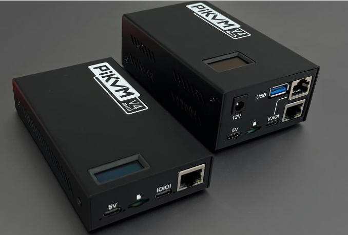

# PiKVM v4 Plus

Hi and welcome to my little PiKVM project.

The goal is to set up a flexible OOB management for my devices in my home lab.

## Main Goal:
Get a basic understanding of the PiKVM platform and how to use it.

For more information, look at this guide.

Basic [Link](/Basic%20use/README.md)

## Feature 1: 4G as a Backup Carrier
We want a secondary path to the internet for my PiKVM, so we will be using a 4G modem. It will be activated if the ethernet connection loses access to the internet.

## Feature 2: Tailscale VPN 
We will be using Tailscale VPN so I can access the PiKVM remotely. As long as the PiKVM has internet access, it will be accessible.

For more information regarding Tailscale VPN, look at this guide.

## Feature 3: OOB Management of Serial Devices 
Since I have a lot of routers and switches, I needed a way to access them remotely. This is how I set them up.

## Feature 4: PiKVM at Scale
I wanted a PiKVM to manage more than one computer.

(guide in progress)
